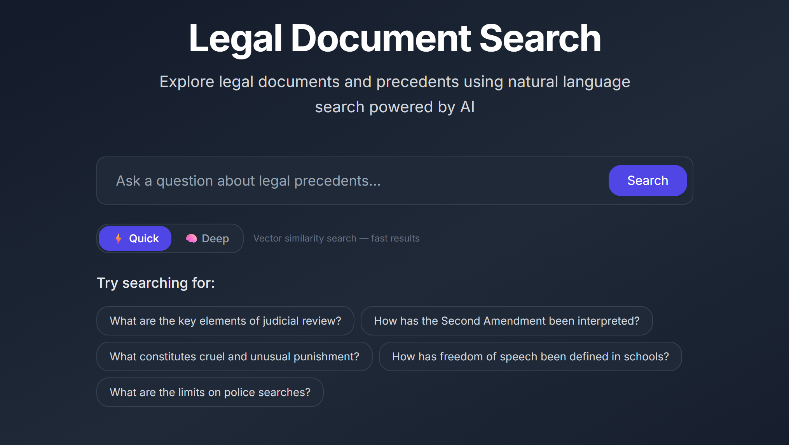
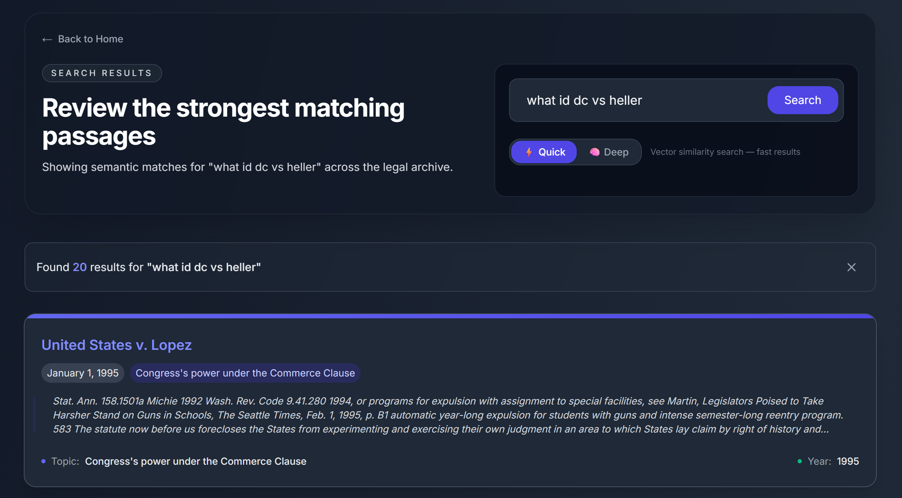

<p align="center">
  
</p>

<h1 align="center">Legal Document Search</h1>

<p align="center">
  <strong>Vectorless, reasoning‑based RAG for landmark U.S. Supreme Court cases</strong>
</p>

<p align="center">
  <a href="#quick-search-pinecone-vector-rag">Quick Search</a> ·
  <a href="#deep-search-tree-based-legal-reasoning">Deep Search</a> ·
  <a href="#setup">Setup</a> ·
  <a href="#references">References</a>
</p>

---

A **Next.js 14** application for searching **13 landmark U.S. Supreme Court cases** with two parallel retrieval systems:

| Mode             | How it works                                                                      |
| ---------------- | --------------------------------------------------------------------------------- |
| **Quick Search** | Pinecone + Voyage AI legal embeddings → fast semantic retrieval                   |
| **Deep Search**  | PageIndex‑inspired tree index + NVIDIA Llama 3.1 70B → structured legal reasoning |

> **Note** — This repository does not use the hosted PageIndex product directly. Instead it implements the core PageIndex idea locally: convert each long legal PDF into a structured, table‑of‑contents‑like tree, then let the model _reason_ over that structure instead of relying only on vector similarity.

---

## What This Project Does

The repo contains two distinct ways to search the same legal corpus:

1. **Quick mode** uses a classic **vector RAG** stack.
   PDFs from `docs/` are chunked with LangChain, embedded with Voyage AI's `voyage-law-2` model, and stored in Pinecone. Queries are embedded and retrieved with Max Marginal Relevance (k=20).

2. **Deep mode** uses a **tree index** instead of Pinecone.
   Python scripts extract PDF text with PyMuPDF, split long documents into page groups, ask NVIDIA's model to identify logical sections, merge those sections into a hierarchical JSON tree, and store the result under `docs/trees/`. At query time, deep search reads those tree files and asks NVIDIA to reason over them.

That second path — **tree‑based, reasoning‑driven retrieval** — is the main idea behind this project.

---

## Why PageIndex‑Style Retrieval Beats Vector Embeddings for Legal Docs

For long legal opinions, semantic similarity is often not enough. Legal answers are buried inside structured sections — syllabus, procedural history, majority opinion, concurrence, dissent, doctrinal analysis — and vector search is only good at finding text that _sounds similar_ to the question. Legal reasoning needs more.

### The 5 Limitations of Vector RAG

PageIndex identifies five core limitations of conventional vector‑based RAG that are especially painful for legal documents:

| #   | Limitation                                  | What goes wrong                                                                                                                |
| --- | ------------------------------------------- | ------------------------------------------------------------------------------------------------------------------------------ |
| 1   | **Query–Knowledge space mismatch**          | Vector retrieval assumes the most semantically similar text is the most relevant — but queries express _intent_, not _content_ |
| 2   | **Semantic similarity ≠ true relevance**    | In legal text, many passages share near‑identical semantics but differ critically in relevance                                 |
| 3   | **Hard chunking breaks semantic integrity** | Fixed‑size chunks (e.g. 1000 chars) cut through sentences, paragraphs, and opinion sections                                    |
| 4   | **Cannot integrate chat history**           | Each query is treated independently — the retriever has no memory of prior context                                             |
| 5   | **Poor handling of in‑document references** | References like "_see Appendix G_" don't share semantic similarity with the referenced content                                 |

### How a PageIndex‑Style Tree Solves These

| Aspect                   | Vector embeddings + Pinecone               | PageIndex‑style tree retrieval                      |
| ------------------------ | ------------------------------------------ | --------------------------------------------------- |
| **Retrieval signal**     | Semantic similarity                        | Structural reasoning over sections and pages        |
| **Preprocessing shape**  | Fixed‑size chunks                          | Logical sections / table‑of‑contents nodes          |
| **Explainability**       | Approximate: "this chunk scored highly"    | Clear: "this section/page was selected"             |
| **Cross‑references**     | Often weak unless wording matches          | Better when the model can follow document structure |
| **Legal opinions**       | Can split holdings across chunk boundaries | Keeps arguments closer to opinion structure         |
| **Multi‑step reasoning** | Needs extra re‑ranking or orchestration    | Native fit for iterative reasoning                  |
| **Infrastructure**       | Embeddings + vector DB + query embeddings  | Tree generation + model reasoning                   |
| **Best use case**        | Fast broad semantic lookup                 | Deep legal analysis over long, structured documents |

### Why It Matters for This Corpus

Landmark court opinions are not flat text. They are long, sectioned arguments where the answer depends on:

- **Where** in the opinion the issue is discussed
- **How** one section references another
- **Whether** the relevant language appears in the majority, concurrence, or dissent
- **How much** surrounding context is needed to interpret the rule correctly

A PageIndex‑style approach is stronger than embeddings here. It helps the model navigate the opinion more like a legal researcher and less like a nearest‑neighbor lookup engine.

---

## Architecture

```text
Browser
  │
  ├── / ─────────────────────────────────→ Landing page
  │                                         │
  │                                         ├── POST /api/bootstrap
  │                                         │     │
  │                                         │     └── POST /api/ingest
  │                                         │           → load PDFs from docs/
  │                                         │           → split into 1000-char chunks
  │                                         │           → embed with Voyage AI
  │                                         │           → upsert into Pinecone
  │                                         │
  │                                         └── route to /search?q=...&mode=...
  │
  └── /search ───────────────────────────→ Search page
                                            │
                                            ├── quick mode → POST /api/search
                                            │                 → query embedding
                                            │                 → Pinecone MMR retrieval
                                            │
                                            └── deep mode → POST /api/deep-search
                                                              → spawn scripts/deep_search.py
                                                              → load docs/trees/*.json
                                                              → send structured context to NVIDIA
                                                              → stream answer back via SSE
```

---

## How the Tree Is Built

Tree generation lives in [`scripts/generate_trees.py`](./scripts/generate_trees.py).

For each document listed in `docs/db.json`, the script:

1. Extracts page text from the PDF with **PyMuPDF**
2. Splits long documents into page groups of ~**8 000** characters
3. Uses **1 overlapping page** between neighboring groups for cross‑boundary context
4. Sends each page group to **NVIDIA's chat completions API** (Llama 3.1 70B)
5. Falls back to **OpenAI** (`gpt-4o-mini`) if `OPENAI_API_KEY` is set and NVIDIA fails
6. Asks the model to identify logical sections — syllabus, facts, majority opinion, concurrence, dissent, etc.
7. Merges and deduplicates chunk outputs by page index
8. Writes one `*_tree.json` file per case under `docs/trees/`

**Key design decision**: chunking is used _only_ to make tree generation feasible under model token limits. The output is not a vector index — it is a **logical section tree**.

### Tree Format

Each case gets a JSON structure shaped like a compact legal table of contents:

```json
{
  "doc_id": "nvidia-mapp_vs_ohio",
  "filename": "mapp_vs_ohio.pdf",
  "title": "Mapp v. Ohio",
  "tree": [
    {
      "title": "Mapp v. Ohio",
      "node_id": "0000",
      "page_index": 1,
      "text": "<root synopsis>",
      "nodes": [
        {
          "title": "Majority Opinion",
          "node_id": "0001",
          "page_index": 1,
          "text": "<section text>"
        }
      ]
    }
  ]
}
```

- The **root node** acts like a case‑level overview
- **Child nodes** act like section entries in a table of contents
- Each node keeps **page information** and **raw section text**

---

## Retrieval Pipelines

### Quick Search: Pinecone Vector RAG

Quick search starts from `POST /api/search`.

1. Validate `PINECONE_API_KEY`, `PINECONE_INDEX`, and `VOYAGE_API_KEY`
2. Embed the user query with Voyage AI using `voyage-law-2`
3. Open the Pinecone index through LangChain's `PineconeStore`
4. Run `maxMarginalRelevanceSearch(query, { k: 20 })`
5. Deduplicate results by document id
6. Return normalized result objects for the UI

This is the **fast path** — useful for quick semantic lookup across the corpus.

### Deep Search: Tree‑Based Legal Reasoning

Deep search starts from `POST /api/deep-search`.

1. Confirm that `docs/trees/` contains generated tree files
2. Spawn [`scripts/deep_search.py`](./scripts/deep_search.py)
3. Load the local tree JSON files
4. Flatten root and child nodes into a bounded legal context window (60 000 chars max)
5. Send that structured context plus the user query to **NVIDIA Llama 3.1 70B**
6. Stream the answer to the browser as **Server‑Sent Events**

> **Important**: Deep mode does _not_ query Pinecone, does _not_ use embeddings at runtime, and depends entirely on the prebuilt tree index.

---

## Legal Cases Corpus

The corpus contains **13 landmark Supreme Court cases** spanning 1803–2008:

| Case                           | Year | Constitutional Topic                      |
| ------------------------------ | ---- | ----------------------------------------- |
| Marbury v. Madison             | 1803 | Judicial Review                           |
| Gibbons v. Ogden               | 1824 | Interstate Commerce                       |
| Mapp v. Ohio                   | 1961 | Fourth Amendment — Search & Seizure       |
| Baker v. Carr                  | 1962 | Equal Protection — Redistricting          |
| Gideon v. Wainwright           | 1963 | Right to Counsel                          |
| Miranda v. Arizona             | 1966 | Right Against Self‑Incrimination          |
| Tinker v. Des Moines           | 1969 | Student Free Speech                       |
| NY Times v. United States      | 1971 | Freedom of the Press                      |
| United States v. Nixon         | 1974 | Executive Privilege                       |
| United States v. Lopez         | 1995 | Commerce Clause Limits                    |
| Bush v. Gore                   | 2000 | Election Law — Equal Protection           |
| Roper v. Simmons               | 2005 | Eighth Amendment — Juvenile Death Penalty |
| District of Columbia v. Heller | 2008 | Second Amendment — Individual Right       |

---

## Technology Stack

| Layer             | Technology                     | Purpose                                |
| ----------------- | ------------------------------ | -------------------------------------- |
| Framework         | Next.js 14 (App Router)        | UI and API routes                      |
| UI                | React 18, Tailwind CSS 3       | Search interface and streaming results |
| Vector embeddings | Voyage AI `voyage-law-2`       | Quick‑mode legal embeddings (1024‑dim) |
| Vector DB         | Pinecone (serverless)          | Quick‑mode retrieval store             |
| PDF parsing       | LangChain `PDFLoader`, PyMuPDF | Ingestion and tree generation          |
| Deep reasoning    | NVIDIA Llama 3.1 70B           | Tree generation and deep search        |
| Fallback LLM      | OpenAI `gpt-4o-mini`           | Tree‑generation fallback only          |
| Icons             | Lucide React, Heroicons        | UI iconography                         |

---

## Screenshots

<p align="center">
  
  <br/><em>Landing page — search mode selection</em>
</p>

<p align="center">
  
  <br/><em>Quick search results with document cards</em>
</p>

---

## Setup

### Prerequisites

- **Node.js** 18+
- **npm**
- **Python** 3.x
- **Pinecone API key** — for quick search
- **Voyage AI API key** — for quick search
- **NVIDIA API key** — for tree generation and deep search
- **OpenAI API key** _(optional)_ — tree‑generation fallback

### Install Dependencies

```bash
# JavaScript
npm install --legacy-peer-deps

# Python
pip install -r requirements.txt
```

### Environment Variables

Create a root `.env` file (see [`.env.example`](./.env.example)):

```env
PINECONE_API_KEY=""
PINECONE_INDEX=""
VOYAGE_API_KEY=""

NVIDIA_API_KEY=""

OPENAI_API_KEY=""

NVIDIA_API_URL="https://integrate.api.nvidia.com/v1/chat/completions"
OPENAI_API_URL="https://api.openai.com/v1/chat/completions"

NVIDIA_TREE_MODEL="meta/llama-3.1-70b-instruct"
NVIDIA_DEEP_SEARCH_MODEL="meta/llama-3.1-70b-instruct"
OPENAI_TREE_MODEL="gpt-4o-mini"

NEXT_PUBLIC_APP_URL=""
PORT="3000"
VERCEL_URL=""

```

#### Variable Reference

| Variable                   | Purpose                                  | Required                 |
| -------------------------- | ---------------------------------------- | ------------------------ |
| `PINECONE_API_KEY`         | Pinecone authentication                  | Yes (quick mode)         |
| `PINECONE_INDEX`           | Pinecone index name                      | Yes (quick mode)         |
| `VOYAGE_API_KEY`           | Voyage legal embeddings                  | Yes (quick mode)         |
| `NVIDIA_API_KEY`           | Tree generation and deep search          | Yes (deep mode)          |
| `OPENAI_API_KEY`           | Fallback provider during tree generation | No                       |
| `NVIDIA_API_URL`           | NVIDIA chat completions endpoint         | Yes (deep mode)          |
| `OPENAI_API_URL`           | OpenAI chat completions endpoint         | If using OpenAI fallback |
| `NVIDIA_TREE_MODEL`        | Tree‑generation model name               | Yes (deep mode)          |
| `NVIDIA_DEEP_SEARCH_MODEL` | Deep‑search model name                   | Yes (deep mode)          |
| `OPENAI_TREE_MODEL`        | OpenAI fallback model name               | If using OpenAI fallback |
| `NEXT_PUBLIC_APP_URL`      | Health/keep‑alive base URL               | No                       |
| `PORT`                     | Local bootstrap self‑call target         | Recommended locally      |
| `VERCEL_URL`               | Used for deployed bootstrap calls        | No                       |

---

## Running the App

### 1. Start Next.js

```bash
npm run dev
```

Open [http://localhost:3000](http://localhost:3000).

### 2. Build the Quick‑Search Vector Index

The app bootstraps Pinecone automatically on load. You can also trigger it manually:

```bash
curl -X POST http://localhost:3000/api/bootstrap
```

This workflow:

- Loads PDFs from `docs/`
- Splits them into **1 000‑character chunks** with **200 overlap**
- Embeds them with Voyage AI (`voyage-law-2`)
- Upserts vectors into Pinecone

### 3. Generate the Tree Index for Deep Search

Deep mode needs tree files under `docs/trees/`.

**From Python:**

```bash
python scripts/generate_trees.py
```

**From the API:**

```bash
curl -X POST http://localhost:3000/api/generate-trees
```

> If tree files don't exist, deep search returns `503`.
> The generator skips trees that already exist — delete a `docs/trees/*_tree.json` file to rebuild a specific case.

---

## API Endpoints

| Route                 | Method | Purpose                                        |
| --------------------- | ------ | ---------------------------------------------- |
| `/api/bootstrap`      | POST   | Starts quick‑search bootstrap                  |
| `/api/ingest`         | POST   | Loads PDFs, chunks, embeds, writes to Pinecone |
| `/api/search`         | POST   | Quick‑mode semantic retrieval                  |
| `/api/deep-search`    | POST   | Deep‑mode streamed tree reasoning              |
| `/api/generate-trees` | POST   | Builds local tree files                        |
| `/api/health`         | GET    | Health endpoint                                |
| `/api/init`           | GET    | Starts keep‑alive service in production        |

---

## Project Structure

```text
.
├── docs/
│   ├── *.pdf                        # 13 Supreme Court case PDFs
│   ├── db.json                      # Case metadata (title, parties, date, topic)
│   └── trees/
│       └── *_tree.json              # Generated tree index files
├── img/                             # Screenshots
├── scripts/
│   ├── deep_search.py               # NVIDIA‑powered tree reasoning
│   └── generate_trees.py            # Chunked tree generation (NVIDIA + OpenAI fallback)
├── src/
│   ├── app/
│   │   ├── api/
│   │   │   ├── bootstrap/route.ts   # Quick‑search bootstrap trigger
│   │   │   ├── deep-search/route.ts # Deep‑search SSE streaming
│   │   │   ├── generate-trees/route.ts
│   │   │   ├── health/route.ts
│   │   │   ├── ingest/route.ts      # Pinecone ingestion worker
│   │   │   ├── init/route.ts        # Keep‑alive initializer
│   │   │   └── search/route.ts      # Quick‑mode vector search
│   │   ├── search/page.tsx          # Results route (both modes)
│   │   ├── services/
│   │   │   ├── bootstrap.ts         # PDF → chunk → embed → upsert
│   │   │   ├── keepAlive.ts         # Production health pinger
│   │   │   └── pinecone.ts          # Index creation and vector checks
│   │   ├── types/                   # TypeScript interfaces
│   │   ├── globals.css
│   │   ├── layout.tsx
│   │   └── page.tsx                 # Landing page
│   ├── components/
│   │   ├── CitationGenerator.tsx    # Bluebook citation with clipboard
│   │   ├── DeepSearchResults.tsx    # Deep‑mode streaming UI
│   │   ├── DocumentView.tsx         # Quick‑mode document modal
│   │   ├── Header.tsx
│   │   ├── LoadingState.tsx         # Bootstrap spinner overlay
│   │   ├── SearchForm.tsx           # Query input + mode toggle
│   │   └── SearchResults.tsx        # Quick‑mode result cards
│   └── lib/
│       ├── search-client.ts         # Client‑side search utilities
│       └── utils.ts                 # Shared helpers
├── .env                             # Environment variables (git‑ignored)
├── package.json
├── requirements.txt                 # Python: requests, pymupdf, python‑dotenv
├── tailwind.config.ts
└── tsconfig.json
```

---

## When To Use Each Mode

|                    | Quick Search                 | Deep Search                        |
| ------------------ | ---------------------------- | ---------------------------------- |
| **Speed**          | Fast (< 2s)                  | Slower (5–15s)                     |
| **Best for**       | Broad semantic lookup        | Structured legal analysis          |
| **Retrieval**      | Vector similarity            | Model reasoning over document tree |
| **Infrastructure** | Requires Pinecone + Voyage   | Requires NVIDIA API + tree files   |
| **Output**         | Document cards with excerpts | Streamed reasoning with citations  |

---

## Implementation Notes

This app avoids vector search in deep mode, but is not yet a full one‑to‑one implementation of PageIndex's ideal retrieval loop. Today, the deep‑search runtime:

- Loads local `*_tree.json` files
- Flattens root and child nodes into a bounded prompt context
- Asks NVIDIA's model to answer using that structured case context

The system is best described as:

- **Vector RAG** for quick mode
- **PageIndex‑inspired structured retrieval** for deep mode

It captures the key design choice: **tree‑based indexing instead of vector‑only chunk retrieval**.

The most accurate label:

> _PageIndex‑inspired indexing and retrieval, implemented locally with chunked tree construction and NVIDIA/OpenAI model calls_

---

## References

- [PageIndex intro: vectorless, reasoning‑based RAG](https://pageindex.ai/blog/pageindex-intro)
- [PageIndex developer docs](https://docs.pageindex.ai/quickstart)
- [PageIndex GitHub repository](https://github.com/VectifyAI/PageIndex)
- [PageIndex case study: 98.7% accuracy on FinanceBench](https://vectify.ai/blog/Mafin2.5)

---

## License

This project is licensed under the [MIT License](LICENSE).
